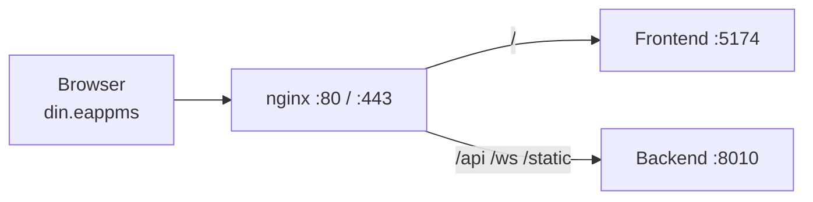

# Standard URL — `din.eappms`

> **Browser error `DNS_PROBE_FINISHED_NXDOMAIN`?**  
> `din.eappms` is **not on the public internet**. Each PC must map the name to your IPC server IP (see [Fix NXDOMAIN](#fix-dns_probe_finished_nxdomain) below).

EAP PMS is configured to open at a **fixed standard URL**:

| Mode | URL |
|------|-----|
| HTTP (default) | **http://din.eappms** |
| HTTPS (optional) | **https://din.eappms** — type `t` / `true` when `run.ps1` / `run.sh` asks |

Running **`run.ps1`** (Windows) or **`./run.sh`** (Ubuntu) automatically:

1. Asks **HTTP or HTTPS** (`true` = HTTPS, Enter/`false` = HTTP)
2. Starts backend (`8010`) and frontend (`5174`)
3. If HTTPS: generates a **self-signed TLS certificate** under `deploy/ssl/` (includes LAN IPs for `https://<ip>` access)
4. Installs/configures **nginx** reverse proxy (port **80**, and **443** when HTTPS)
5. Maps the domain on the **server** (`hosts` / `/etc/hosts`)
6. Prints the standard URL (no `:5174` in the main link)

Configuration file: **`deploy/domain.config.json`**

```json
{
  "domain": "din.eappms",
  "useHttps": false,
  "autoGenerateSsl": true,
  "sslCert": "deploy/ssl/din.eappms.crt",
  "sslKey": "deploy/ssl/din.eappms.key"
}
```

### Other PCs on the same network

No special client permission is required beyond being on the same LAN (and firewall ports **80/443** open on the server — the installer adds these).

| Access | Works? |
|--------|--------|
| `http://din.eappms` or `https://din.eappms` | Yes, if DNS/hosts/`din.eappms` resolves to the server |
| `http://<server-ip>` (HTTP mode) | Yes via nginx |
| `https://<server-ip>` (HTTPS mode) | Yes (cert includes LAN IPs); browser may still warn for self-signed |
| `http://<server-ip>:5174` | Always works (direct Vite, bypasses nginx TLS) |
| Mobile app `http://<server-ip>:8010` | Always works — **not affected by web HTTPS** |

### Mobile PMS operator app

HTTPS on the web portal does **not** change the mobile app. The operator app uses **`http://<server-ip>:8010`** (Setup screen). Keep that URL as HTTP unless you intentionally change the mobile build to call HTTPS.

---

## Network-wide access (PC, Android, tablets)

`run.ps1` / `run.sh` now start a **LAN DNS service** on the IPC server so `din.eappms` can resolve for every device on the LAN.

### One-time router / IT setup (recommended)

Ask IT to set the **DHCP DNS server** on the factory WiFi/LAN to the **IPC IP**:

```
DHCP DNS server = 10.151.47.6
```

After that, **all devices** (Windows PCs, Android phones, tablets) open:

```
http://din.eappms
```

No hosts file or per-PC scripts needed.

### What the application does automatically (IPC server)

| Step | Service | Port |
|------|---------|------|
| nginx reverse proxy | `http(s)://din.eappms` | 80 (and 443 if HTTPS) |
| LAN DNS | `din.eappms` -> IPC IP | 53 |
| Backend API | proxied via nginx | 8010 |
| Frontend | proxied via nginx | 5174 |

Optional: pin a fixed IPC IP in `deploy/domain.config.json` (recommended for production with DHCP reservation):

```json
"lanIp": "10.151.47.6"
```

Leave `"lanIp": ""` for **auto-detect** — LAN DNS refreshes every 30 seconds when the address changes.

### Dynamic IP (network / DHCP changes)

| Access method | What happens when IPC IP changes |
|---------------|----------------------------------|
| **Direct IP** `http://<current-ip>` | Always works — nginx listens on all interfaces (port 80). Use any IP shown when `run.ps1` finishes. |
| **LAN DNS** (`din.eappms` via router DHCP DNS) | DNS answers update every 30s to the new IP, but **router DHCP DNS must still point to the IPC** — if the IPC moved from `10.151.47.6` to `10.151.47.20`, IT must update the router (or use a **static DHCP reservation** for the IPC). |
| **Client hosts file** (`Setup-Client-PC.bat`) | Must be re-run with the new IPC IP on each PC. |
| **Login page** | Shows current LAN URLs from `GET /api/config/network` when you can reach the server. |

**Production recommendation:** reserve a static DHCP address for the IPC MAC address so the IP never changes.

**No DNS at all:** open `http://192.168.1.116` or `http://10.151.47.6` (whichever is current) from any phone or PC on the same LAN — port 80, no `:5174` required.

### Fallback (if router DNS cannot be changed)

Use `deploy\Setup-Client-PC.bat` (Admin) on each PC, or manual hosts entry.

---

This error means **this PC does not know what IP `din.eappms` is**. The app on the IPC server can be running fine — the name just is not registered on your machine.

### On the IPC server (same PC where you ran `run.ps1`)

1. Re-run **as Administrator**:
   ```powershell
   .\run.ps1
   ```
2. Or manually edit `C:\Windows\System32\drivers\etc\hosts` (Admin):
   ```
   127.0.0.1   din.eappms
   ```
3. Flush DNS: `ipconfig /flushdns`
4. Open: **http://din.eappms**

### On other PCs (operator / supervisor machines) — e.g. client `10.151.32.56`, IPC `10.151.47.6`

`din.eappms` is **not on the public internet**. Each client PC must map the name to the **IPC server IP** on your LAN.

**Option A — standalone batch file (easiest, no PowerShell policy errors)**

Copy both files to the client PC:

- `deploy\Setup-Client-PC.bat`
- `deploy\Setup-Client-PC.ps1`

**Right-click `Setup-Client-PC.bat` → Run as administrator**

Default IPC IP is `10.151.47.6`. Or from an Admin command prompt:

```bat
Setup-Client-PC.bat 10.151.47.6
```

**Option A2 — PowerShell bypass (if you only copied the .ps1 file)**

```powershell
powershell -NoProfile -ExecutionPolicy Bypass -File .\Setup-Client-PC.ps1 -ServerIp 10.151.47.6
```

(Run PowerShell as Administrator.)

**Option B — from full project folder**

```powershell
.\scripts\Register-ClientHost.ps1 -ServerIp 10.151.47.6
```

**Option C — manual hosts file** (Administrator)  
Edit `C:\Windows\System32\drivers\etc\hosts` on the **client PC**:

```
10.151.47.6   din.eappms
```

Then on the client:

```powershell
ipconfig /flushdns
```

Open: **http://din.eappms** (not `din.eappms/login` until the site loads)

**Use the IPC IP on the same network as the client.** If the server shows both `192.168.1.116` and `10.151.47.6`, PCs on `10.151.32.x` should use **`10.151.47.6`**, not the 192.168 address.

### For the whole factory (best)

Ask IT for an **internal DNS A record**:

```
din.eappms   A   <ipc-server-ip>
```

No hosts file needed on each PC after that.

### Until DNS is ready — use IP directly

```
http://<ipc-server-ip>:5174
```

or (if nginx on IPC is working):

```
http://<ipc-server-ip>
```

---

## Quick start

### Windows

```powershell
# Run as Administrator (recommended — port 80 + hosts file)
.\run.ps1
```

Open: **http://din.eappms** (default). Type `t` / `true` at the HTTPS prompt if you want `https://din.eappms`.

### Ubuntu

```bash
chmod +x run.sh scripts/*.sh
./run.sh
```

Open: **http://din.eappms** (default). Type `t` / `true` at the HTTPS prompt if you want `https://din.eappms`.

---

## Architecture



| Path | Proxied to |
|------|------------|
| `/` | Frontend (React) |
| `/api/*` | FastAPI |
| `/ws` | WebSocket |
| `/static/*` | Uploaded files |
| `/docs` | API documentation |

---

## DNS for other PCs on the factory LAN

`run.ps1` / `run.sh` configure nginx **on the server**. Other computers still need DNS so `din.eappms` resolves to the app server IP.

Ask IT to add an **internal DNS A record**:

```
din.eappms   A   <server-ip>
```

Example: if the Ubuntu server is `192.168.1.116`:

```
din.eappms   A   192.168.1.116
```

After DNS propagates, every PC on the network opens **http://din.eappms** without typing an IP or port.

### Single-PC test (no DNS yet)

**Windows** (Administrator) — `C:\Windows\System32\drivers\etc\hosts`:

```
192.168.1.116   din.eappms
```

**Ubuntu** — `/etc/hosts` (added automatically by `install-nginx.sh` on the server):

```
192.168.1.116   din.eappms
```

---

## HTTPS (optional — chosen at run time)

HTTPS is **optional**. On each `run.ps1` / `run.sh` start you are asked:

```text
Enable HTTPS? Type t/true for HTTPS, or f/false/Enter for HTTP [f]:
```

- **Enter / `f` / `false`** → HTTP (`http://din.eappms`) — best for factory LAN
- **`t` / `true`** → HTTPS (`https://din.eappms`) — self-signed cert auto-created under `deploy/ssl/`

Skip the prompt with an environment variable:

```powershell
$env:USE_HTTPS = "t"   # or "f" / "true" / "false"
.\run.ps1
```

```bash
USE_HTTPS=t ./run.sh    # or f / true / false
```

When HTTPS is selected, nginx listens on **443** and redirects **80 → HTTPS**.

Self-signed certs show a browser warning until trusted. For production, replace files under `deploy/ssl/` (or point `sslCert` / `sslKey` to company CA paths) and re-run.

### Company CA or Let's Encrypt

Point paths in `domain.config.json` to your certs, set `"autoGenerateSsl": false`, choose HTTPS at the prompt (or `USE_HTTPS=true`), then re-run.

**Let's Encrypt (Ubuntu, public DNS only):**

```bash
sudo apt install certbot python3-certbot-nginx
sudo certbot --nginx -d din.eappms
```

---

## Troubleshooting

| Issue | Solution |
|-------|----------|
| nginx fails on Windows | Run PowerShell **as Administrator** (port 80, hosts, firewall) |
| Port 80 already in use | Stop IIS/skype/other web server, or change IIS binding |
| `din.eappms` works on server only | Add internal DNS A record for other PCs |
| Login/API fails | Confirm nginx proxies `/api/` to port 8010 |
| Still need fallback | `http://<ip>:5174` always works |

**Stop nginx (Windows portable):**

```powershell
.\deploy\nginx-win\nginx.exe -p .\deploy\nginx-win -s quit
```

**Reload nginx (Ubuntu):**

```bash
sudo nginx -t && sudo systemctl reload nginx
```

---

## Related files

| File | Purpose |
|------|---------|
| `deploy/domain.config.json` | Domain name and HTTPS settings |
| `deploy/nginx-site.conf.template` | Ubuntu nginx site template |
| `scripts/install-nginx.sh` | Ubuntu nginx setup (called by `run.sh`) |
| `scripts/Install-Nginx.ps1` | Windows nginx setup (called by `run.ps1`) |
| `deploy/nginx-win/` | Windows nginx (downloaded on first run) |
